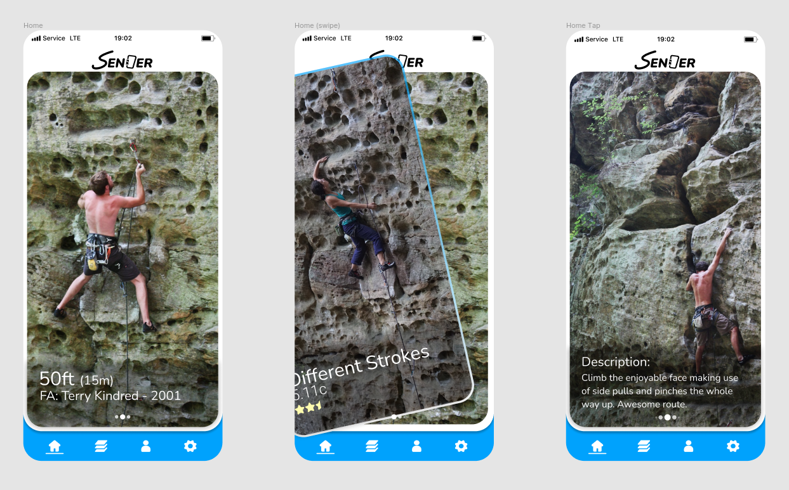
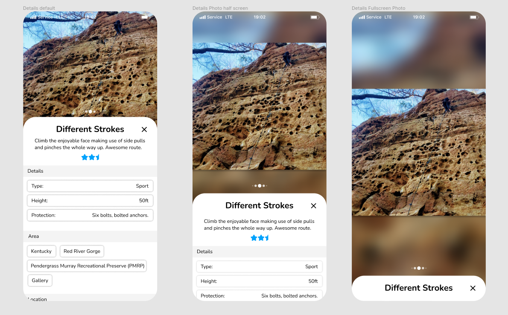
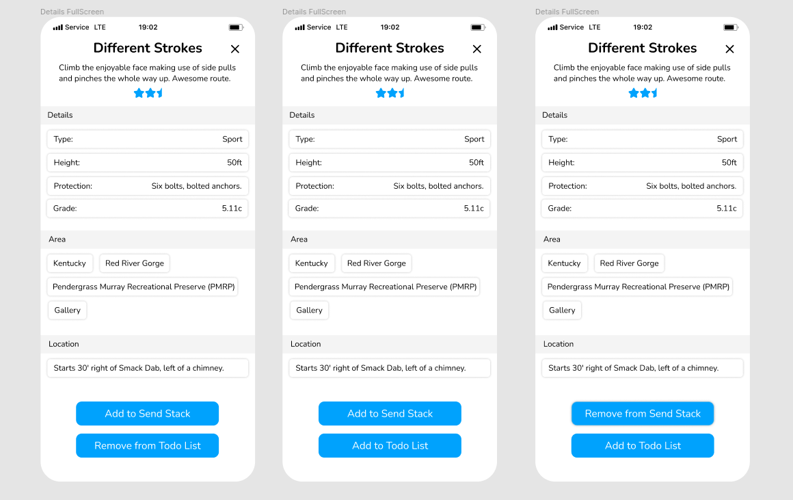
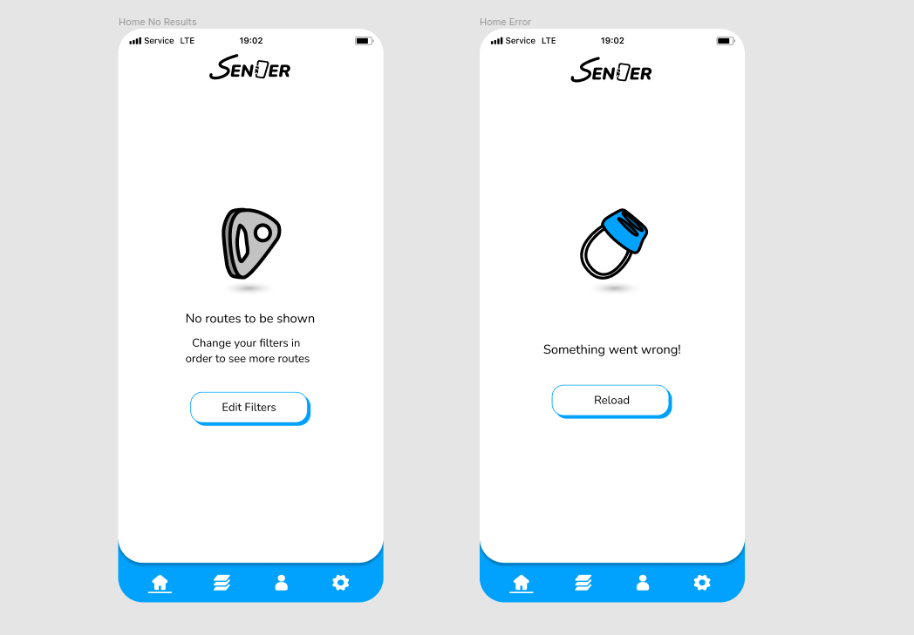
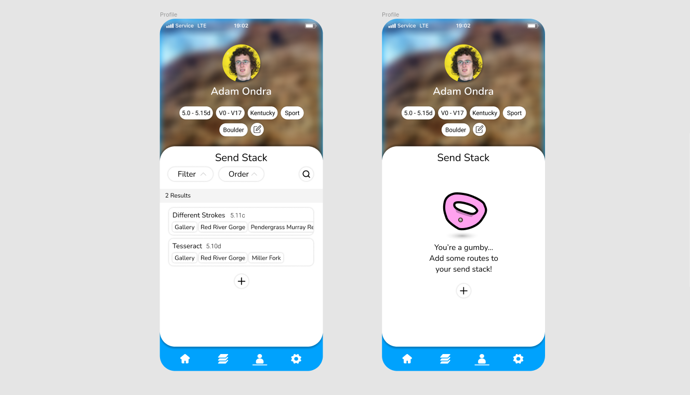
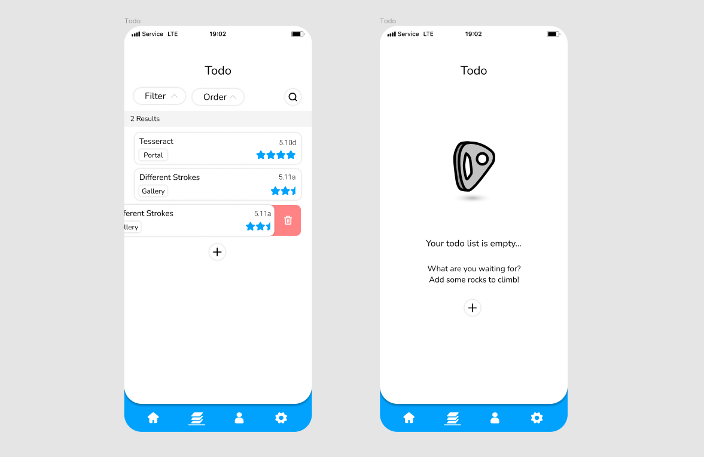
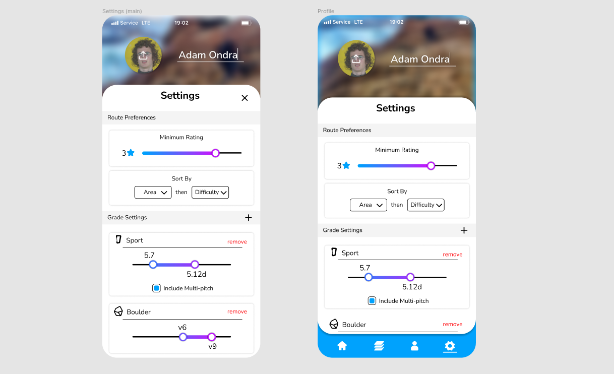

# Sender *(Work in Progress)*
### Do you ever day dream about finding the perfect match?
### Do you get sweaty hands thinking about putting your hands in their pockets?
### Well with sender. You dont have to anymore! Just swipe left and right to filter down climbing routes until you've found your next project!
---
### [API Repository](https://github.com/micahmeadows/sender-api)
### [Figma Design](https://www.figma.com/file/7Z9lCK1SgUi1mQmRCTCgEa/Sender?node-id=0%3A1)
---

  

## - Description:
Sender is an app for finding rock climbing routes around the world that you might want to climb. You will be able to filter to choose what routes you want to see. Sport, Trad, Boulder, etc. As well as grade, location, and more.

The app will show you climbing routes, and information about them. Then, you will decide if you want to add it to your todo by swiping right, decline it by swiping left, or if you've previously climbed it you can swipe up to add it to your *Send Stack* (A fancy name for a tick list that pays homage to an app idea me and [Jack](https://github.com/johnwhh) had a while ago).

--- 

## - Motivation:
The goal for this app is for me to complete a full stack project. And build an app to distribute to my friends!

--- 
## - Goals:
- Design an app in figma
- Build a flutter frontend to match the figma design
- Design a Mountain Project scraping tool
- Build an SQL Database
- Build an API that leverages the scraping tool and databse to provide data to the front end
- Finally have something on my resume

--- 

## - Technologies:
- Frontend: Flutter
- Backend: Node.js (API), Puppeteer (Scraping), SQL Server (Database)
- Design: Figma (Design), Rive (Animation)

## - More Images:

  

  

  

  

  

  

